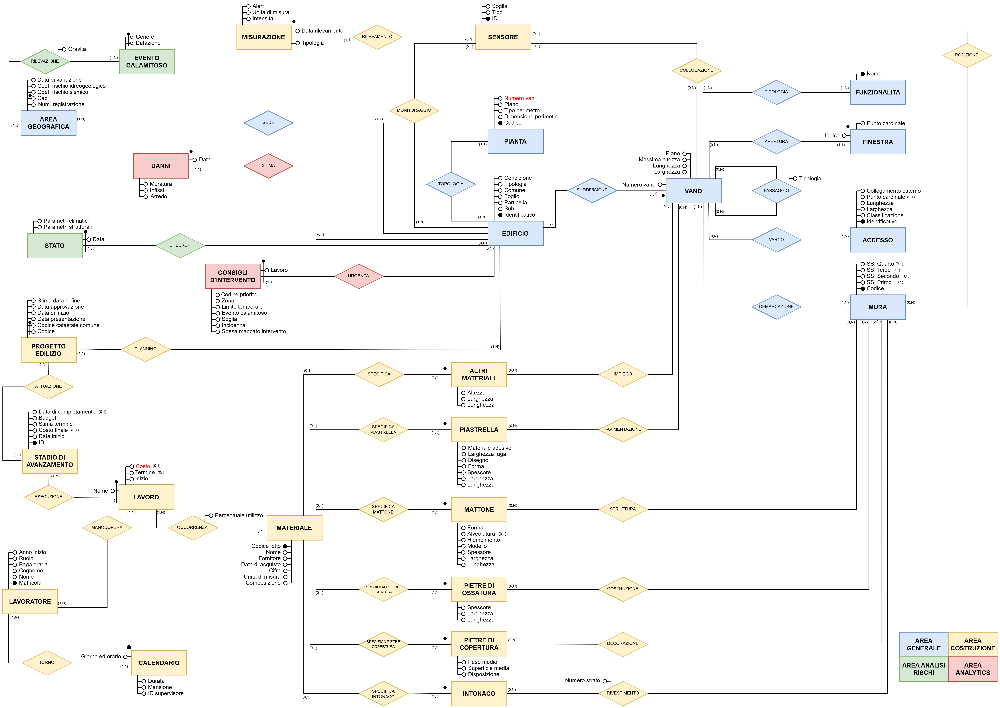

# Smart Buildings Database Management System

A comprehensive database management system for monitoring and managing smart buildings, including structural integrity, environmental conditions, construction projects, and disaster response capabilities.

**_Note: The entire project content is in Italian._**

## Project Overview

This project implements a complete database solution for smart building management, featuring:

- **Building Structure Management**: Complete tracking of buildings, floors, rooms, and structural elements
- **IoT Sensor Integration**: Real-time monitoring of environmental and structural conditions
- **Construction Project Management**: Full lifecycle management of building projects and renovations
- **Disaster Response System**: Automated assessment and response to natural disasters and emergencies
- **Material and Resource Management**: Comprehensive tracking of construction materials and workforce


## Database Schema



## File Structure

```
├── 1. script_schema_logico.sql    # Database schema creation
├── 2. trigger&function.sql        # Triggers and custom functions
├── 3. popolamento.sql             # Sample data population
├── 4. operazioni.sql              # Core business operations
├── 5. analytics.sql               # Advanced analytics and reporting
├── Documentazione.pdf             # Project documentation
├── Schema ER.pdf                  # Entity-Relationship diagram
├── Schema ER ristrutturato.pdf    # Restructured ER diagram
└── Specifiche.pdf                 # Project specifications
```
